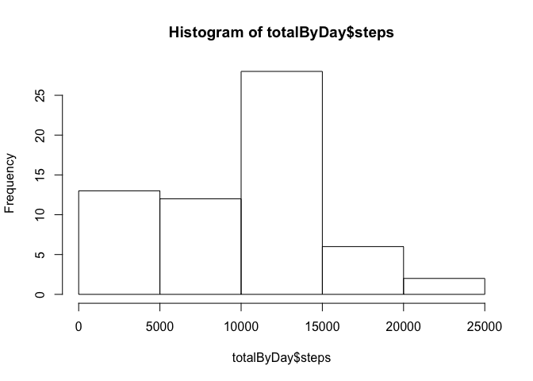
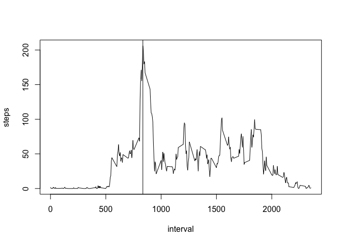
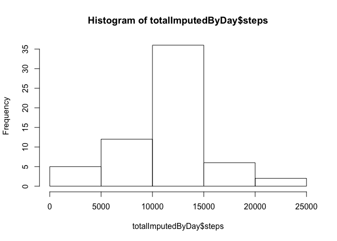
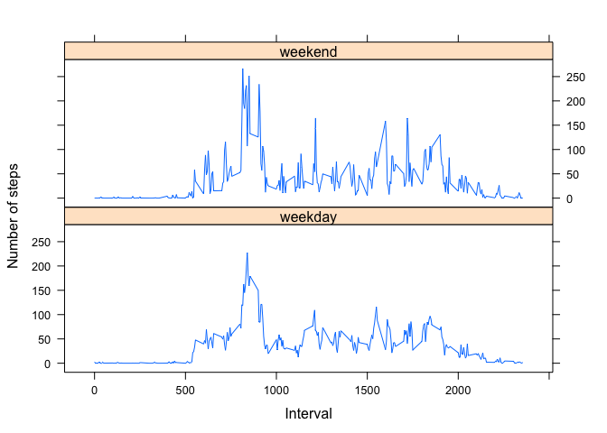

## Loading and preprocessing the data


```r
data <- read.table(unz("activity.zip", "activity.csv"), header=T, quote="\"", sep=",")

# Calc avg steps per day
avgByInterval<-aggregate(list(steps=data$steps), by=list(interval=data$interval),  FUN=mean, na.rm=TRUE, na.action=NULL)
```


## What is mean total number of steps taken per day?


```r
totalByDay<-aggregate(list(steps=data$steps), by=list(date=data$date),  FUN=sum, na.rm=TRUE, na.action=NULL)

meanSteps<-mean(totalByDay$steps,na.rm=TRUE)
medianSteps<-median(totalByDay$steps,na.rm=TRUE)

hist(totalByDay$steps)
```

<!-- -->

- Mean of total steps per day is 9354.2295082.  
- Median total steps per day is 10395.


## What is the average daily activity pattern?

```r
max<-avgByInterval[which.max(avgByInterval$steps),]$interval

plot(steps ~ interval, avgByInterval, type="l")
abline(v=max)
```

<!-- -->

```r
max
```

```
## [1] 835
```

Max average numbner of steps occurs at interval 835  
This represents peak activity at 8:35am

## Imputing missing values

```r
missing<-sum(is.na(data$steps))

uniqueDates<-unique(data$date)
uniqueIntervals<-unique(data$interval)

dataImputed<-data

# Impute using daily average
dataImputed$steps[is.na(dataImputed$steps)]<- with(dataImputed, ave(steps, uniqueIntervals, FUN = function(x) mean(x, na.rm = TRUE)))[is.na(dataImputed$steps)]

totalImputedByDay<-aggregate(list(steps=dataImputed$steps), by=list(date=dataImputed$date),  FUN=sum, na.rm=TRUE, na.action=NULL)

hist(totalImputedByDay$steps)
```

<!-- -->

```r
imputedMean<-mean(totalImputedByDay$steps,na.rm=TRUE)
imputedMedian<-median(totalImputedByDay$steps,na.rm=TRUE)
```

There are 2304 missing values.

Missing values have been imputed by using the average number of steps for the same interval across all days.

After imputation:
- Mean is 1.0766189\times 10^{4}
- Median is 1.0766189\times 10^{4}

Occurrences of steps at 5000 have reduced

Both mean and median have reduced

## Are there differences in activity patterns between weekdays and weekends?


```r
dataImputed$weekpart <- ifelse(weekdays(as.Date(totalImputedByDay$date))%in%c("Saturday","Sunday"),"weekend", "weekday")

dataImputed$weekpart <- as.factor(dataImputed$weekpart)

totalImputedByInterval <- aggregate(list(steps=dataImputed$steps), by=list(interval=dataImputed$interval, weekpart=dataImputed$weekpart),  FUN=mean, na.rm=TRUE, na.action=NULL)

qplot(interval, steps, data=totalImputedByInterval, group=1, facets = .~weekpart,geom="line")
```

<!-- -->

On weekdays and weekends there is a spike in activity in the morning.
On the weekend there is more activity later in the day


